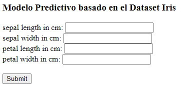

# Puesta en Producción de un modelo de aprendizaje automático con Flask y Heroku


La creación de un proyecto de aprendizaje automático en un jupyter notebook ejecutaándose en local para unos datos de entrada controlados es una cosa, pero implementar el modelo como una aplicación web y su posterior puesta en producción como servicio para usuarios en la red es otra cosa muy distinta.

Para que un producto basado en el aprendizaje automático tenga éxito, es necesario crear servicios que otros equipos puedan usar o un producto donde los usuarios puedan interactuar. Para ello, el objetivo final es brindar el modelo como un servicio, basándose en un concepto llamado API. Una API es la forma en que los sistemas informáticos se comunican entre sí, actuando como un agente que lleva la información del usuario al servidor y luego nuevamente del servidor al usuario devolviendo la respuesta. Flask proporciona esa capacidad, actuando como una API entre su modelo y el archivo HTML.

Por otra parte utilizaremos Heroku como plataforma en la nube para crear nuestro servicio. Heroku es uno de los PaaS más utilizados en la actualidad en entornos empresariales por su fuerte enfoque en resolver el despliegue de una aplicación. Ademas te permite manejar los servidores y sus configuraciones, escalamiento y la administración. A Heroku solo le dices qué lenguaje de backend estás utilizando (Python, Java, PHP, NodeJS…) o qué base de datos vas a utilizar y te preocupas únicamente por el desarrollo de tu aplicación. Heroku es gratuito para aplicaciones de poco consumo y posteriormente hablaremos de como crear una cuenta gratuita para desplegar nuestro servicio.


## Introducción a la Aplicación a desarrollar.

Como hemos comentado, el objetivo de este artículo es crear un modelo de aprendizaje automático alojado en un servidor web que nos preste el servicio de hacer predicciones vía http. Para ello vamos a estructura el proyecto en 4 partes:

- Entorno de desarrollo.
- Implementación y entrenamiento del Modelo.
- Implementación de la API en Flask.
- Despliegue del servicio web en Heroku


## Entorno de desarrollo

Antes que nada vamos a necesitar preparar el entorno de desarrollo para la implementación de la aplicación. Para ello primero procedemos a clonar el repositorio base donde os he dejado preparado todo el código necesario para el desarrollo de esta práctica.

```python
cd you_proyect
git clone https://github.com/jaisenbe58r/Iris_Heroku.git
```
El proyecto se estructura de la siguiente manera:

```python
your proyect
-- checkpoints
---- model.pkl
-- images
-- model
---- model.py
-- templates
---- index.html
---- result.html
-- .gitignore
-- .slugignore
-- Procfile
-- readme.md
-- requirements.txt
-- script.py
```

En el directorio de su proyecto, comencemos creando un virtualenv:
```python
python -m venv venv/
```

Y activemos con el el entorno virtual:
```python
\env\Scripts\activate.bat
```
Instalamos todas las dependencias del proyecto:

```python
pip install -r requirements.txt
```
Con esto ya tendríamos preparado todo el entorno para el desarrollo de nuestra aplicación.

## Implementación y entrenamiento del Modelo.

El modelo de aprendizaje automático va ser el encargado de clasificar entre 3 variedades de Flor de Iris. estas variedades o clases son:

- Iris Setosa
- Iris Versicolour
- Iris Virginica

Esta clasificación será el resultado de la inferencia de unos datos de entrada introducidos por el usuario:

- largo del sépalo en cm
- ancho del sépalo en cm
- largo de pétalo en cm
- ancho de pétalo en cm

Puede encontrar más información sobre el dataset en el siguiente enlace: https://archive.ics.uci.edu/ml/datasets/iris


En nuestro caso utilizaremos el módulo ```datasets``` de la librería ```sklearn`` y lo dividimos entre conjuntos de entrenamiento y test:

```python
from sklearn.datasets import load_iris
from sklearn.model_selection import train_test_split

X, y = load_iris(return_X_y=True)
X_train, X_test, y_train, y_test = train_test_split(X, y, test_size=0.2, stratify=y)
```

Vamos a utilizar como modelo un ```RandomForestClassifier()``` entrenado con el subconjunto de entrenamiento y validado con el conjunto de test.

```python
X, y = load_iris(return_X_y=True)
X_train, X_test, y_train, y_test = train_test_split(X, y, test_size=0.2, stratify=y)

clf = RandomForestClassifier()
print(clf.fit(X_train, y_train).score(X_test, y_test))

>>> 0.933
```

Posteriormente al entrenamiento, serializamos el modelo y lo guardamos en la carpeta ```checkpoints/```.

```python
filename = 'checkpoints/model.pkl'
pickle.dump(clf, open(filename, 'wb'))
```

No está de mal, validar estos pasos cargando el modelo y hacer una nueva predicción con el mismo conjunto de test para validar los resultados

```python
loaded_model = pickle.load(open(filename, 'rb'))
result = loaded_model.score(X_test, y_test)
print(result)

>>> 0.933
```

También comprobamos a hacer una predicción con datos reales para ver la respuesta:
```python
print(loaded_model.predict([[5.6, 2.7, 4.2, 1.3]]))

>>> [1]
```

Con esto, ya tenemos el modelo preparado para servirlo desde una API.


## Implementación de la API en Flask.

Comenzamos por explicar en base a una aplicación Flask más simple:

```python
from flask import Flask

app=Flask(__name__)

@app.route('/',methods=['GET','POST'])
def main():
    return str('Hello World!! ')

if __name__=="__main__":
    app.run()
```
Explicando las líneas más importantes tenemos:

```python
app=Flask(__name__)
```
Aquí, estamos asignando el constructor Flask a una variable que necesitamos para ejecutar todos los procesos.

```python
@app.route('/',methods=['GET','POST'])
```
```app.route()``` es un decorador en Python. En Flask, cada función se activará cuando vaya a una página específica, todo el tráfico en esta URL invocará la función ```main()```.


Con esto bastaría para realizar su primera aplicación Flask. En nuestro caso necesitamos que la función ```main()``` fuera una función que desplegará el modelo para hacer las predicciones de los inputs recibidos por el método POST. Para ello, utilizamos una función definida como ```result()```que se encargará de recoger los inputs de entrada al modelo, transformarlos a una lista acorde a lo esperado por el modelo para posteriormente llamar a la función ```value_predictor()```donde se realizarán las predicciones. Una vez tengamos los resultados, se mostrarán en el template ```result.html``` como podemos ver más adelante.

```python
#importing libraries
import os
import numpy as np
import flask
import pickle
from flask import Flask, render_template, request

#creating instance of the class
app=Flask(__name__)

#to tell flask what url shoud trigger the function index()
@app.route('/')
@app.route('/index')
def index():
    return flask.render_template('index.html')

def ValuePredictor(to_predict_list):
    to_predict = np.array(to_predict_list).reshape(1, 4)
    loaded_model = pickle.load(open("checkpoints/model.pkl","rb"))
    result = loaded_model.predict(to_predict)
    return result[0]

@app.route('/result', methods = ['POST'])
def result():
    if request.method == 'POST':
        to_predict_list = request.form.to_dict()
        to_predict_list = list(to_predict_list.values())
        try:
            to_predict_list = list(map(float, to_predict_list))
            result = ValuePredictor(to_predict_list)
            if int(result)==0:
                prediction='Iris-Setosa'
            elif int(result)==1:
                prediction='Iris-Virginica'
            elif int(result)==2:
                prediction='Iris-Versicolour'
            else:
                prediction=f'{int(result)} No-definida'
        except ValueError:
            prediction='Error en el formato de los datos'

        return render_template("result.html", prediction=prediction)

if __name__=="__main__":

    app.run(port=5001)
```

Como particularidad, podemos observar en el código siguiente que disponemos de dos rutas, ```/index``` y ```result```, la primera se lanzará nada más se despliegue la API y es la encargada de recoger los datos a a partir del template ```index.html```:



Una vez completados los campos, se pulsa el botón submit que nos enviará a la ruta ```/result``` donde se desplegará el template ```result.html``` con el resultado final de la predicción:


Para probar nuestra API en local bastaría con ejecutar el script y acceder la la URL proporcionada por consola:

```python
python script.py
```


## Despliegue del servicio web en Heroku

Como hemos comentado en la introducción, Heroku es una plataforma como servicio (PaaS) que permite a los desarrolladores crear, ejecutar y operar aplicaciones completamente en la nube en lugar de hacerlo localmente en su máquina. En este proyecto lo implementaremos usando GitHub automáticamente cada vez que hagamos un pull a la rama ```deploy```

Antes de implementar su código, debemos crear una cuenta en Heroku:

```python
heroku login
```

### Creando una aplicación Heroku

Para implementar el proyecto primero debemos crear una aplicación Heroku.

```python
heroku apps:create web_app_iris
```

### Archivo requirements.txt

Este es el primer punto de entrada al programa. Instalará todas las dependencias necesarias para ejecutar su Código. ```requirements.txt``` le dirá a heroku que este proyecto requerirá todas estas librerias para ejecutar correctamente la aplicación.

### Procfile

Heroku requiere que Procfile esté presente en el directorio raíz de su aplicación. Le dirá a Heroku cómo ejecutar la aplicación. Asegúrese de que sea un archivo simple sin extensión.
La parte a la izquierda de los dos puntos es el tipo de proceso y la parte a la derecha es el comando a ejecutar para iniciar ese proceso. En esto, podemos decir en qué puerto se debe implementar el código y puede iniciar y detener estos procesos.

```python
web: gunicorn script:app
```

Este archivo le dice a heroku que queremos usar el proceso web con el comando gunicorn y el nombre de la aplicación.


## Implementar en Heroku

Asegúrese de que el archivo ```Procfile``` y el ```requirements.txt``` estén presentes en el directorio raíz de su aplicación. Posteriormente procedemos a crear el repositorio en github y crear la rama ```deploy``` para conectar el despliegue automático desde GitHub.

Una vez creado el repositorio en GitHub creamos la rama ```deploy```.


En el dashboard principal de la aplicación HEROKU veremos desplegada la aplicación:


Entramos dentro 

```python
git branch deploy
git checkout deploy
git push
```

Una vez creada la rama ```deploy```vamos a configurar el despliegue automático a Heroku desde GitHub, para ello entramos dentro del proyecto y seleccionamos la ventana _Deploy_:


Seleccionamos el método de despliegue como GitHub y conectamos el repositorio del proyecto en GitHub:


Una vez conectado el repositorio, seleccionamos la rama ```deploy```y habilitamos el despliegue automático:


Con esto ya podemos desplegar nuestro servicio automáticamente cada vez que se haga un ```push``` de la rama ```deploy```. Para ello, vamos a comprobarlo realizando el ```push```y situándonos en la pestaña de _Activity_ del proyecto Heroku para ver el estado del despliegue:


Una vez completado el despliegue, ya tendremos acceso a la app desde el botón _Open app_ situado a la parte de arriba a la derecha:


Con ello, ya tendríamos acceso a nuestra aplicación desplegada como un servicio dentro de Heroku:


# Conclusiones


Con este artículo, mi intención ha sido que puedan desplegar de forma exitosa este tipo de aplicaciones de manera sencilla y robusta para poder probar todas sus aplicaciones sin tener que preocuparse de toda la infraestructura IT de crear un servicio desde cero.

Espero que os haya sido de utilidad y que lo tengáis en cuenta como una herramienta más para el desarrollo de vuestras aplicaciones basadas en aprendizaje automático.


